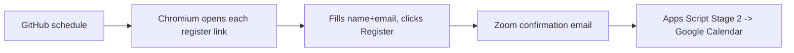

# Zoom auto-register (GitHub Actions + Playwright)

True zero-touch registration for your recurring Zoom classes. A scheduled
GitHub Action launches a **real Chromium browser**, opens each subject's
registration link, fills your details, and clicks **Register**. Zoom emails
the confirmation, and the Apps Script (Stage 2, in the parent folder) drops it
into Google Calendar.

Free: private-repo Actions include 2,000 minutes/month; each run takes ~2–3 min.

```
auto-register/
  .github/workflows/register.yml   # schedule + CI steps
  register.mjs                     # the Playwright automation
  subjects.json                    # YOUR 5 register links (edit each semester)
  package.json
```

## Setup (one time, ~10 minutes)

### 1. Fill in your subjects
Edit [subjects.json](subjects.json). For each subject, open its **reminder email**,
copy the `.../meeting/register/...` link, and paste it as the `url`. Delete any
subjects you don't want. (Links are stable for the whole semester.)

### 2. Create a private GitHub repo and push this folder
Use **this `auto-register/` folder as the repository root** (so `.github/` sits at
the top). For example:

```powershell
cd "auto-register"
git init
git add .
git commit -m "Zoom auto-register"
gh repo create zoom-auto-register --private --source . --push
```
(Or create the repo on github.com and push manually. Keep it **private**.)

### 3. Add your details as repository secrets
On GitHub: **Settings → Secrets and variables → Actions → New repository secret**.
Add three secrets:

| Name | Value |
|------|-------|
| `ZOOM_FIRST` | `Achyut` |
| `ZOOM_LAST` | `Upadhyay` |
| `ZOOM_EMAIL` | `2025ogd1002@iitjammu.ac.in` |

### 4. Test it now
**Actions** tab → **Zoom auto-register** → **Run workflow**. Watch the log:
- `Result: registered` / `already-registered` → success.
- `Result: uncertain` or a failure → a screenshot is saved under the run's
  **Artifacts** (`screenshots`); open it to see what the page showed.

### 5. Let it run on schedule
The default schedule (in `register.yml`) is **Fri 17:00 IST** and **Sat 06:00 IST**.
Edit the two `cron` lines (they're in **UTC**) to match your class days/times.

## How registration + calendar fit together



You still need the **Apps Script** running (see ../README.md) for the calendar
half. This repo only handles registration.

## Notes & troubleshooting
- **Bot check**: the workflow runs headed Chromium under `xvfb` to look like a
  normal browser. If Cloudflare ever hard-blocks the automated browser, use the
  one-tap `register_bookmarklet` (in the parent folder) as a fallback — it runs
  in your own Safari/desktop browser and always passes.
- **Selectors**: `register.mjs` matches fields by label/name/placeholder, so it
  is resilient to new subjects. If Zoom restyles the form and a field isn't
  found, check the artifact screenshot and adjust the patterns in `fillField`.
- **Re-runs are safe**: registering an occurrence you already registered for
  returns "already registered", and the calendar side de-duplicates events.
- **Occurrence**: the page defaults to the next upcoming session, which is what
  gets registered. Keep the schedule close to your session days so the "next"
  occurrence is the right one.
